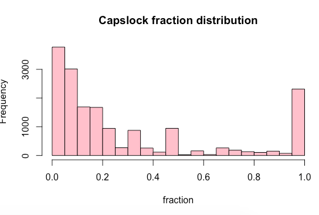
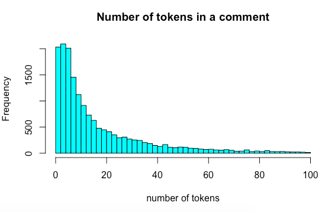

# Capslock

There are a lot of stereotypes about why some people use *capslock* so often on the Internet. In literature *capslock* has been used to emphasize or manifest something. Later on, one of the first bloggers said that he used *capslock* when he wanted to shout and it became a kind of trend. Now you may be considered too emotional, too happy or too angry, if you write LIKE THIS. People in Russia may judge that you use *capslock* so often, because you are a blond or a sportsman or you are just young. But is it true? My small research brakes the stereotypes and shows that the phenomena of *capslock* is more complicated than it looks. 

# 1. My goal

This statistical research is aimed to examine how capitalization patterns on the most popular Russian social media Vkontakte vary with respect to 5 explanatory variables: a user's **gender, age, current city, interests** and **theme of the Vkontakte public page**, from which the data is collected. The response variable is the **fraction of capslock words** in a user's comment. 

This research was inspired by the paper on capitalization for English, called ["Social and Emotional Correlates of capitalization on Twitter"](https://aclweb.org/anthology/papers/W/W18/W18-1102/). S. Chan and A. Fyshe revealed that English capitalization on Twitter does vary with respect to gender: female use words with uppercase characters more than male. Also the research showed that capslock in English is used more in negative, than in positive tweets. The important point is that the guys considered not only words with uppercase letters as capslock, but looked also at the "meaningfully capitalized" tokens, i.e. the words which were capitalized intentionally, as in case of acronyms. 

I thought it would be interesting and funny to investigate the Russian case and compare it with the English one. But I conducted the analysis in a little different way. I took Vkontakte instead of Twitter and did not take sentiment into consideration yet, but focused on several social markers, not only gender.  

# 2. The method, and why the capslock fraction

The choice of such a dependent variable - a fraction of capslock words - is not made by accident. Of course, I could take just a number of capslock words in a comment as a metric, but in Vkontakte the length of the comment is not limited, so the absolute number of words will bring us wrong understanding of the picture.

The main thing I do in my research is grouping users and their comments with capslock by gender, age and other characteristics and then compare the distributions of the capslock fraction in different groups using statistical tests. Then I analyze and visualize the results. 

# 3. Collecting the data

Using Python3 and VK API, I have extracted comments with capslock words from 5 Russian public pages Vkontakte:

- [https://vk.com/vdud](https://vk.com/vdud) (the public page of Yury Dud's Youtube blog. He is a popular Russian journalist and interviewer)
- [https://vk.com/lentach](https://vk.com/lentach) (the public page originated from a popular social media Lenta.ru)
- [https://vk.com/sci](https://vk.com/sci) (the page about popular science)
- [https://vk.com/public143177265](https://vk.com/public143177265) (the page about how it is tough to be a mother, with funny and serious discussions)
- [https://vk.com/my_iz_cccp](https://vk.com/my_iz_cccp) (the page for those who has nostalgia for the Soviet Era)

There is no serious reason behind choosing these public pages, but all of them are relatively popular among some social groups and about different subjects. 

The algorithm for collecting data from these pages is as follows:

1. Collect all post ids from the page
2. Collect comments with Russian capslock words to the given posts, as many as possible 
3. Collect nested comments with capslock for comments from step 2
4. Collect information about every user (sex, date of birth, current city) and create a data frame
5. Delete rows where all of sex, date of birth and current city columns are empty
6. Collect information about user's interests (put all the information about user subscriptions in a separate column)
7. Save everything into .csv file

All scripts can be fount in a "collect_data" folder. 

 

# 3. Data preprocessing and feature engineering

Preprocessing of the collected data is one of the the longest and important parts. Steps:

### 1. **Join 5 .csv files into one data frame**

The initial number of comments with capslock was as follows:

    source
    lentach     8741
    sci         9030
    sssr        9591
    vdud        2772
    yajemati    6613

36747 rows altogether. 

### 2. Clean comment texts from hashtags and links to other user ids (in nested comments) using regular expressions

### 3. Add columns:

- number of tokens in a comment (len(token)>2),
- number of capslock tokens in a comment,
- capslock tokens

### 4. Choose comments with only meaningful capslock.

I needed a big corpora to evaluate the probability that every capslock word is an acronym. For this purpose I extracted all texts from **the Russian Wikipedia** using the WikiExtractor script from Appertium and evaluated this probability as follows:

    score = upper_count / (upper_count + lower_count), 

where *upper_count* is a count of a given word in Wikipedia texts in uppercase, and *lower_count* is a count of the word in lowercase. 

If this score value was more than 0.9, I regarded the token to be written in caps all the time. The rest tokens were regarded as **meaningfully capitalized**. So, when I further count the fraction of capslock words in a comment, I consider only meaningfully capitalized tokens.

(To be honest, I also needed to manually change the list of manually capitalized tokens - for example, remove those which were actually acronyms, but not presented in Wikipedia - but the idea is the same)

Than I refreshed the values in the following columns in a way that they include only meaningful capslock:

- number of capslock tokens in a comment,
- capslock tokens.

### **5. Create age column from a birth date column**

### 6. Add a "country" column with values "Russia", if the current city of the user is in Russia, or "Other"

The scripts for data preprocessing and choosing meaningful capslock may be seen in 

- *choose-meaningful-capslock.ipynb*
- *cleaning data & feature engineering.ipynb*

The final list of meaningfully capitalized tokens can be found in *all_meaningful_caps.txt*. 

# 4. Final dataframe: columns

The final dataframe has the following columns:

- `source` — the short name of the public page
- `parent_id` — the ID of the post on the wall
- `parent_text` — the text of the post
- `comment_id` — was needed to get a nested comment (the answer to some comment)
- `comment_text` — the text of the comment under that post
- `from_id` — user ID
- `first_name` — first name of the user
- `last_name` — last name of the user
- `sex`
- `bdate` — birthday date of the user
- `age`
- `birth_year`
- `city` — the city where the user lives
- `country` — Russia or other
- `activity` — a list of activities of the pages the user is subscribed at, separated with "|"
- `n_tokens` — number of tokens in a comment
- `n_caps` — number of words capitalized
- `caps` — capitalized words in a comment separated by space
- `caps_frac` — a fraction of capitalized words in a comment
- `mean_caps` —  meaningfully capitalized words in a comment separated by space
- `n_mean_caps` —  number of meaningfully capitalized words in a comment
- `caps_mean_frac` — a fraction of meaningfully capitalized words in a comment

# 5. Descriptive statistics

I start my analysis from some descriptive statistics. 

The following code will be in R, you may reproduce it:

    cap <- data.table::fread("capitalization.csv")
    cap <- cap[!duplicated(cap$from_id), ]
    nrow(cap) # we have 35973 observations (acronyms AND meaningful caps)
    
    cap_m <- cap[cap$n_mean_caps > 0,]
    nrow(cap_m) # and only 17014 observations with meaningfully capitalized tokens
    
    hist(cap_m$caps_mean_frac, 
         col="pink", 
         main="Capslock fraction distribution",
         xlab="fraction") # dependent variable distribution

    hist(cap_m[cap_m$n_tokens < 100,]$n_tokens, 
         main="Number of tokens in a comment", 
         breaks=50, 
         col="cyan", 
         xlab="number of tokens")

    psych::describe(cap_m$caps_mean_frac)

So, we are interested in analyzing only around 17,000 observations with meaningfully capitalized tokens. The mean fraction of capslock in these observations is 0.31, standard deviation is 0.34 and median is 0.15. It means that most comments have a rather small fraction of capslock. Another point is that our data is not normally distributed: a lot of comments have a fraction less than 0.1 and equal 1 (it means that all words in a comment are written with uppercase letters).

# 6. Sex

Now let's look at male and female capslock distributions. 

    cap_m$sex <- factor(cap_m$sex)
    cap_m$sex <- revalue(cap_m$sex, c("1"="female", "2"="male")) # rename factor levels
    cap_m <- cap_m[cap_m$sex != 0,]
    table(cap_m$sex)

    table(cap_m[cap_m$source=="yajemati"]$sex)

It seems that male write capslock more than female in Vkontakte. Even in the "Ya je mati" public page, which is supposed to have female contents, we have almost the same number of comments with meaningful capslock as female. 

    psych::describeBy(cap_m$caps_mean_frac,cap_m$sex)

We see that there is also a big difference in a mean capslock fraction: 0.25 (female) vs. 0.33 (male). 

The variance of capslock in these two groups is also different:

    bartlett.test(cap_m$caps_mean_frac ~ cap_m$sex) #check homogeneity of variance

    ggplot(cap_m,aes(x = sex, y = caps_mean_frac, fill = sex)) +
      geom_violin() + 
      geom_boxplot(width=0.05, alpha = .3) +
      labs(
        caption = paste0('n female = ',length(cap_m$sex[cap_m$sex == 'female']),', 
                         'n male = ',length(cap_m$sex[cap_m$sex == 'male']))
    	)

Let's conduct several statistical tests: T-test, Wilcoxon rank sum test (insensitive to outliers and deals with abnormal distribution), bootstrap Wilcoxon test. 

    t.test(cap_m[cap_m$sex == "male"]$caps_mean_frac, 
           cap_m[cap_m$sex == "female"]$caps_mean_frac, 
           var.equal = FALSE)

    wilcox.test(cap_m[cap_m$sex == "male"]$caps_mean_frac, 
                cap_m[cap_m$sex == "female"]$caps_mean_frac, 
                alternative = "greater")

    # bootstrap
    pvals <- c()
    for(i in 1:1000){
      male_sample <- sample(cap_m[cap_m$sex == "male"]$caps_mean_frac, 100) #71.6 %, 300 - 95-100%
      female_sample <- sample(cap_m[cap_m$sex == "female"]$caps_mean_frac, 100)
      pvals <- c(wilcox.test(male_sample, 
                             female_sample, 
                             alternative = "greater")
                 $p.value,pvals)
    }
    cat(length(pvals[pvals < 0.05])/1000*100,"%")

All the tests show that there is a significant difference in distributions of male and female capslock fractions. The Wilcoxon test shows that male on the average use more capslock in a comment than female. The bootstrap with 1000 samples of size 100 also proves this point: it 73% of samples male's fraction is on the average greater than female's one (p-value < 0.05). 

It would be interesting to look deeply into male and female distributions only for the "female" public. 

    # only "yajemati" public page
    only_yajemati <- cap_m[cap_m$source=="yajemati"]
    psych::describeBy(only_yajemati$caps_mean_frac, only_yajemati$sex)

    wilcox.test(only_yajemati[only_yajemati$sex == "male"]$caps_mean_frac, 
                only_yajemati[only_yajemati$sex == "female"]$caps_mean_frac, 
                alternative = "greater")

Again, the difference between male and female distributions here is obvious. 

    ggplot(cap_m,aes( x = caps_mean_frac, fill = sex)) +
      geom_density(alpha = .3)

If we look at a density plot, we may see that female's capslock fraction in the comments is concentrated mostly from 0 to 0.1, but the male's curve is a little bit above the female's one all along the horizontal axis. 

So, we may conclude that on average male use more capslock in a comment than female. 

# 7. City

    cap_city <- filter(cap_m, country == "Russia")
    nrow(cap_city) # 13322 users live in Russia at the moment
    
    n_city <- nrow(cap_city$city)
    cap_city$n_city <- 1
    
    # count the number of observations in every city
    city_counts <- aggregate(cap_city$n_city, 
    												by=list(city=cap_city$city), 
    												FUN=sum)
    
    # choose cities with more than 100 observations
    city_list <- city_counts[city_counts$x > 100,]$city 
    cap_city_filtered <- cap_city[cap_city$city %in% city_list,]
    nrow(cap_city_filtered) # 8023 observations left for the analysis
    
    psych::describeBy(cap_city_filtered$caps_mean_frac,cap_city_filtered$city)

    # the output
    
    Descriptive statistics by group 
    group: Chelyabinsk   
    vars   n mean   sd median trimmed mad min max range skew kurtosis   se
    X1    1 224  0.3 0.31   0.17    0.24 0.2   0   1     1 1.24     0.35 0.02
    ---------------------------------------------------------------------------- 
    group: Kaliningrad   
    vars   n mean   sd median trimmed  mad  min max range skew kurtosis   se
    X1    1 139 0.27 0.31   0.12    0.22 0.15 0.01   1  0.99 1.34     0.49 0.03
    ---------------------------------------------------------------------------- 
    group: Kazan   
    vars   n mean   sd median trimmed  mad  min max range skew kurtosis   se
    X1    1 175 0.36 0.35   0.22    0.33 0.26 0.01   1  0.99 0.86    -0.76 0.03
    ---------------------------------------------------------------------------- 
    group: Krasnodar   
    vars   n mean   sd median trimmed mad  min max range skew kurtosis   se
    X1    1 240 0.31 0.33   0.17    0.26 0.2 0.01   1  0.99 1.12    -0.16 0.02
    ---------------------------------------------------------------------------- 
    group: Krasnoyarsk   
    vars   n mean   sd median trimmed  mad min max range skew kurtosis   se
    X1    1 187 0.26 0.31   0.14     0.2 0.16   0   1     1 1.47     0.87 0.02
    ---------------------------------------------------------------------------- 
    group: Moscow   
    vars    n mean   sd median trimmed  mad min max range skew kurtosis   
    seX1    1 2763 0.28 0.33   0.12    0.22 0.14   0   1     1 1.32      0.3 0.01
    ---------------------------------------------------------------------------- 
    group: Nizhny Novgorod   
    vars   n mean   sd median trimmed  mad min max range skew kurtosis   se
    X1    1 216 0.27 0.32   0.12    0.21 0.14   0   1     1 1.47     0.74 0.02
    ---------------------------------------------------------------------------- 
    group: Novosibirsk   
    vars   n mean   sd median trimmed  mad  min max range skew kurtosis   se
    X1    1 305  0.3 0.34   0.14    0.26 0.17 0.01   1  0.99 1.14    -0.22 0.02
    ---------------------------------------------------------------------------- 
    group: Omsk   
    vars   n mean   sd median trimmed  mad  min max range skew kurtosis   se
    X1    1 145  0.3 0.35   0.14    0.24 0.16 0.01   1  0.99 1.26     0.01 0.03
    ---------------------------------------------------------------------------- 
    group: Perm   
    vars   n mean   sd median trimmed  mad min max range skew kurtosis   se
    X1    1 200 0.34 0.35   0.17     0.3 0.19   0   1     1    1    -0.55 0.02
    ---------------------------------------------------------------------------- 
    group: Rostov-on-Don   
    vars   n mean   sd median trimmed  mad min max range skew kurtosis   se
    X1    1 223 0.34 0.37   0.14    0.29 0.16   0   1     1    1    -0.66 0.02
    ---------------------------------------------------------------------------- 
    group: Saint Petersburg   
    vars    n mean   sd median trimmed  mad min max range skew kurtosis   se
    X1    1 1959 0.28 0.32   0.12    0.22 0.14   0   1     1 1.34     0.39 0.01
    ---------------------------------------------------------------------------- 
    group: Samara   
    vars   n mean   sd median trimmed  mad  min max range skew kurtosis   se
    X1    1 222  0.3 0.32   0.17    0.25 0.18 0.01   1  0.99 1.26     0.17 0.02
    ---------------------------------------------------------------------------- 
    group: Saratov   
    vars   n mean   sd median trimmed  mad min max range skew kurtosis   se
    X1    1 110 0.27 0.32   0.11    0.21 0.14   0   1     1 1.38     0.67 0.03
    ---------------------------------------------------------------------------- 
    group: Tyumen   
    vars   n mean   sd median trimmed  mad min max range skew kurtosis   se
    X1    1 124 0.32 0.36   0.14    0.28 0.17   0   1     1 0.98    -0.69 0.03
    ---------------------------------------------------------------------------- 
    group: Ufa   
    vars   n mean   sd median trimmed  mad min max range skew kurtosis   se
    X1    1 140 0.36 0.36    0.2    0.32 0.23   0   1     1 0.87    -0.86 0.03
    ---------------------------------------------------------------------------- 
    group: Volgograd   
    vars   n mean   sd median trimmed  mad  min max range skew kurtosis   se
    X1    1 155 0.29 0.32   0.14    0.24 0.18 0.01   1  0.99 1.21     0.17 0.03
    ---------------------------------------------------------------------------- 
    group: Voronezh   
    vars   n mean   sd median trimmed  mad  min max range skew kurtosis   se
    X1    1 175 0.28 0.32   0.14    0.23 0.16 0.01   1  0.99 1.33     0.33 0.02
    ---------------------------------------------------------------------------- 
    group: Yekaterinburg   
    vars   n mean   sd median trimmed  mad  min max range skew kurtosis   se
    X1    1 321 0.29 0.33   0.14    0.24 0.17 0.01   1  0.99 1.26     0.16 0.02

We see that the smallest mean capslock fraction is in Krasnoyarsk (0.26) and the biggest - in Ufa and Kazan (0.36).

    ggplot(cap_city_filtered,aes(x = city, y = caps_mean_frac, fill = city)) +
      geom_violin() +
      geom_boxplot(width=0.05, alpha = .3)

The violin plot also shows different distribution between some cities. 

    wilcox.test(cap_city_filtered[cap_city_filtered$city == "Moscow",]$caps_mean_frac,
                cap_city_filtered[cap_city_filtered$city == "Saint Petersburg",]$caps_mean_frac)

So, there is no difference between capslock usage in Moscow and Saint Petersburg. 

    wilcox.test(cap_city_filtered[cap_city_filtered$city %in% c("Moscow", "Saint Petersburg"),]$caps_mean_frac,
                cap_city_filtered[!cap_city_filtered$city %in% c("Moscow", "Saint Petersburg"),]$caps_mean_frac)

And there is difference between Moscow and Petersburg, from one side, and other cities, from the other side. 

    wilcox.test(cap_city_filtered[cap_city_filtered$city %in% c("Moscow", "Saint Petersburg"),]$caps_mean_frac,
                cap_city_filtered[!cap_city_filtered$city %in% c("Moscow", "Saint Petersburg"),]$caps_mean_frac,
                alternative="less")

So, in Moscow and Petersburg people write capslock less than in other cities. 

# 8. Public page theme

    ggplot(cap_m,aes( x = caps_mean_frac, fill = source)) +
      geom_density(alpha = .3)

    ggplot(cap_m,aes(x = source, y = caps_mean_frac, fill = source)) +
      geom_violin() +
      geom_boxplot(width=0.05, alpha = .3)

    kruskal.test(caps_mean_frac ~ as.factor(source), data = cap_m)
    psych::describeBy(cap_m$caps_mean_frac,cap_m$source)

We may see, that there is significant difference in distributions of capslock fraction with respect to the theme of the public page.  Distributions of "vdud" and "sssr" publics seem to differ from the others most. 

Let's check that.

    vdud_sssr <- rbind(cap_m[cap_m$source == "vdud",],
                       cap_m[cap_m$source == "sssr",])
    other_source <- rbind(cap_m[cap_m$source == "lentach",],
                          cap_m[cap_m$source == "sci",],
                          cap_m[cap_m$source == "yajemati",])
    wilcox.test(vdud_sssr$caps_mean_frac,
                other_source$caps_mean_frac,
                alternative="greater")

Interestingly, the mean fraction in "vdud" and "sssr" comments on the average is significantly larger, than in other public pages. One of the reasons may be the age of the subscribers. 

# 9. Age

    caps_age <- cap_m[cap_m$age <= 60]
    hist(caps_age$age, col = "yellow", breaks=70)

    # age as factor - grouping
    caps_age$age_rounded <- round(as.integer(as.character(caps_age$age)),-1)
    caps_age_avg <-
      caps_age %>%
      dplyr::group_by(age_rounded) %>%
      dplyr::summarize(avg_caps_frac = mean(caps_mean_frac))
    
    ggplot(caps_age,aes(x=caps_mean_frac)) + 
      geom_histogram(aes(y=..density..),col = "darkgreen", fill = "darkgreen", alpha = .5) +
      geom_text(data = caps_age_avg, 
                mapping = aes(x = avg_caps_frac, 
                              y = 8, 
                              label = round(avg_caps_frac,2)), 
                angle = 90, 
                vjust = 1.3) +
      facet_grid(~age_rounded) +
      geom_vline(caps_age_avg, 
                 mapping = aes(xintercept = avg_caps_frac), 
                 colour = 'red', 
                 linetype = 'dashed') +
      theme(axis.text.x = element_text(angle = 90, hjust = 1))

The red line means the capslock mean. We may observe that teenagers and people around 50 use capslock more frequently, than others. Let's check statistically:

    kruskal.test(caps_mean_frac ~ as.factor(age_rounded), data = caps_age)

    ggplot(caps_age, aes(x = as.factor(age_rounded), 
                         y = caps_mean_frac, 
                         fill = age_rounded)) +
      geom_violin() +
      geom_boxplot(width=0.05, alpha = .3)

And yes, there is statistical difference of capslock fraction distributions between different age groups. 

I think it is a funny thing to know that nowadays only youth and elderly people use capslock on Runet more than other generations. Looks like elderly people behave like children again! :) These two generations may be more emotional, they may have more spare time to write comments... Or elderly people just cannot switch to lowercase so often due to some physiological reasons. 

# 10. Interests

To analyze whether capslock fraction depends on a user's interests, I will perform LDA topic modeling. I will do it in Python3 (as it is easier for me) and then run statistical tests in R again. 

I will work with "activity" column, which means the list of topics of users' subscriptions. This column symbolizes interests of a user. 

    import pandas as pd
    import gensim
    from gensim.corpora import *
    from gensim.models import CoherenceModel
    from tqdm.auto import tqdm
    
    
    df = pd.read_csv("capitalization.csv") # read dataframe
    df = df[df.n_mean_caps > 0] # analyze comments with only meaningful capslock 
    df = df[~df.activity.isna()] # choose rows with not empty activity field
    len(df) # 13350
    df.activity

    activities = df.activity.values.tolist()
    activities = [i.split(" | ") for i in activities]
    # assign index to every type of activity
    dictionary = Dictionary(activities) 
    # make a corpus of documents, 
    # where we know the activity index and the frequency of this activity
    corpus = [dictionary.doc2bow(act) for act in activities]

Let's find optimal number of topics, looking at the coherence of the LDA model:

    n_topics = [7,8,9,10,11,12,13,14,15]
    cohs = {}
    
    for n in tqdm(n_topics):
        
        lda_train = gensim.models.ldamulticore.LdaMulticore(
                    corpus=corpus,
                    id2word=dictionary,
                    num_topics = n,
                    chunksize=100,
                    workers = 3,
                    eval_every = 1,
                    per_word_topics=True)
        
        coherence_model_lda = CoherenceModel(model=lda_train, 
                                            texts=activities, 
                                            dictionary=dictionary, 
                                            coherence='c_v')
        
        coherence_lda = coherence_model_lda.get_coherence()
        cohs[n] = coherence_lda
    
    print(cohs)

We see, that the best coherence is achieved for 11 topics. Let's train this model properly (for example, 50 passes through the dataset) and save it. 

    lda_train = gensim.models.ldamulticore.LdaMulticore(
                    corpus=corpus,
                    id2word=dictionary,
                    num_topics = 11,
                    chunksize=100,
                    workers = 3,
                    eval_every = 1,
                    per_word_topics=True, 
                    passes = 50)
        
    coherence_model_lda = CoherenceModel(model=lda_train, 
                                            texts=activities, 
                                            dictionary=dictionary, 
                                            coherence='c_v')
        
    coherence_model_lda.get_coherence() # 0.363537623154878
    
    lda_train.save("lda_final.model")

Now look at the distribution of most important words for every of 11 topics:

    lda_train.print_topics(11,num_words=15)

    [(0,
      '0.252*"Football" + 0.134*"Sports Organization" + 0.070*"Sport" + 0.060*"Martial Arts" + 0.058*"Football Team" + 0.047*"Movies" + 0.036*"Athlete" + 0.028*"Fitness" + 0.027*"TV Channel" + 0.025*"Internet Media" + 0.023*"Show, Program" + 0.020*"Sports Club" + 0.019*"Business" + 0.015*"City Community" + 0.012*"Hockey"'),
     (1,
      '0.626*"Humor" + 0.022*"Youth Organization" + 0.021*"Movies" + 0.020*"Education" + 0.018*"Show, Program" + 0.018*"Science" + 0.016*"Photography" + 0.015*"Animation" + 0.014*"Creative Work" + 0.012*"Open group" + 0.012*"Literature" + 0.011*"Animals" + 0.010*"Discussion Сlub" + 0.009*"Society" + 0.009*"Public page"'),
     (2,
      '0.152*"Education" + 0.108*"Science" + 0.088*"Humor" + 0.071*"Movies" + 0.063*"Tourism, Travel" + 0.045*"Business" + 0.034*"History" + 0.027*"Society" + 0.027*"Philosophy" + 0.025*"Public page" + 0.024*"Photography" + 0.024*"Literature" + 0.021*"Creative Work" + 0.018*"Internet Media" + 0.012*"City Community"'),
     (3,
      '0.134*"Food, Recipes" + 0.078*"Personal Care" + 0.055*"Healthy Lifestyle" + 0.052*"Humor" + 0.052*"Creative Work" + 0.050*"Gender Relations" + 0.044*"Literature" + 0.043*"Parents & Children" + 0.036*"Fashion, Clothing, Shoes" + 0.035*"Astrology, Esoterics" + 0.033*"Interior Design" + 0.027*"Public page" + 0.027*"City Community" + 0.024*"Philosophy" + 0.023*"Education"'),
     (4,
      '0.223*"Cars" + 0.124*"Repair, Construction" + 0.068*"Car Owners" + 0.039*"City Community" + 0.031*"Active Recreation" + 0.030*"Science" + 0.026*"Humor" + 0.025*"Tourism, Travel" + 0.025*"Society" + 0.024*"Auto Goods" + 0.019*"Motorcycling" + 0.017*"Products, Stores" + 0.016*"Classifieds" + 0.016*"Business" + 0.013*"Internet Media"'),
     (5,
      '0.108*"City Community" + 0.081*"Business" + 0.064*"Classifieds" + 0.046*"Job Search" + 0.030*"Internet Media" + 0.027*"Products, Stores" + 0.022*"Clothing, Shoes" + 0.020*"Tourism, Travel" + 0.017*"Real Estate" + 0.015*"Training Courses" + 0.014*"Advertising" + 0.014*"Finance" + 0.012*"Café, Restaurant" + 0.012*"Food Delivery" + 0.012*"Websites"'),
     (6,
      '0.196*"Creative Work" + 0.098*"Photography" + 0.053*"Culture" + 0.042*"Literature" + 0.039*"Animals" + 0.037*"Artist" + 0.032*"Design" + 0.028*"Fashion, Clothing, Shoes" + 0.028*"Movies" + 0.025*"Animation" + 0.020*"Education" + 0.018*"Fan Club" + 0.015*"Museum, Gallery, Exhibition" + 0.013*"Cultural Center" + 0.013*"Religion"'),
     (7,
      '0.197*"Internet Media" + 0.099*"City Community" + 0.072*"Education" + 0.054*"Politics" + 0.047*"History" + 0.039*"Discussion Сlub" + 0.038*"Society" + 0.025*"Tourism, Travel" + 0.023*"Country" + 0.021*"Mass media" + 0.021*"Culture" + 0.020*"Government Organization" + 0.020*"Religion" + 0.017*"Military Arts" + 0.017*"Public Organization"'),
     (8,
      '0.287*"Public page" + 0.040*"Website" + 0.034*"Art and entertainment" + 0.028*"Mass media" + 0.027*"Open group" + 0.021*"Entertainment" + 0.018*"Erotic" + 0.015*"Group of artists" + 0.015*"Dating" + 0.013*"Websites" + 0.013*"Internet store" + 0.012*"Show" + 0.012*"Gender Relations" + 0.011*"Album" + 0.011*"Movies"'),
     (9,
      '0.218*"Video Games" + 0.135*"Games" + 0.061*"Humor" + 0.047*"Video Game" + 0.028*"Streamer" + 0.025*"Animation" + 0.023*"Internet Media" + 0.023*"Blogger" + 0.019*"Creative Work" + 0.018*"Movies" + 0.018*"Technology, Electronics" + 0.017*"Programming" + 0.017*"Online Game" + 0.017*"Esports Organization" + 0.016*"Science"'),
     (10,
      '0.137*"Musician" + 0.104*"Music" + 0.076*"Band" + 0.065*"Electronic Music" + 0.060*"Rap, Hip-Hop" + 0.047*"Internet Media" + 0.039*"Music Sharing" + 0.036*"Rock" + 0.024*"Show, Program" + 0.024*"Clothing, Shoes" + 0.022*"Movies" + 0.016*"Culture" + 0.015*"Heavy Metal" + 0.014*"Fashion, Clothing, Shoes" + 0.014*"Humor"')]

A nice interactive visualization of division into topics can be made in the following way:

    import pyLDAvis.gensim
    import pickle 
    import pyLDAvis
    
    pyLDAvis.enable_notebook()
    LDAvis_prepared = pyLDAvis.gensim.prepare(lda_train, corpus, dictionary)
    LDAvis_prepared

Now let's predict one of 11 "classes" for every user with this LDA model. This class will emphasize the bag of interests of a user.  

    activity_classes = []
    activity_probs = []
    for j in range(len(activities)):
        topic_dist = {v:k for k,v in lda_train.get_document_topics(corpus[j], 
    																																minimum_probability=0.0)}
        max_prob = max(topic_dist.keys())
        max_class = topic_dist[max_prob]
        activity_classes.append(max_class)
        activity_probs.append(max_prob)
    
    topics = lda_train.print_topics(11,num_words=15)
    topics_d = {i[0]:i[1] for i in topics}
    class_descriptions = [topics_d[i] for i in activity_classes]
    
    df["class"] = activity_classes # index of class
    df["class_probs"] = activity_probs
    df["class_descr"] = class_descriptions
    
    df.groupby(by="class").from_id.count()

Above is the number of users belonging to every class. The dataframe now has 3 more columns:

This dataframe with users' interests can be found in *"capitalization-interests.csv".* 

The code for LDA is in *"training-LDA-model.ipynb*".

Now let's compare the capslock distribution among the groups with different interests. We will do this in R again.  

    cap <- data.table::fread("capitalization-interests.csv")
    cap <- cap[!duplicated(cap$from_id), ]
    nrow(cap) # 13253
    psych::describeBy(cap$caps_mean_frac, cap$class)

    Descriptive statistics by group 
    group: 0
       vars   n mean   sd median trimmed  mad min max range skew kurtosis   se
    X1    1 221 0.36 0.35    0.2    0.32 0.22   0   1     1 0.89    -0.74 0.02
    ------------------------------------------------------------ 
    group: 1
       vars    n mean   sd median trimmed  mad min max range skew kurtosis   se
    X1    1 3744 0.36 0.35    0.2    0.32 0.23   0   1     1 0.87    -0.79 0.01
    ------------------------------------------------------------ 
    group: 2
       vars    n mean   sd median trimmed  mad min max range skew kurtosis   se
    X1    1 2414 0.27 0.31   0.12    0.21 0.14   0   1     1 1.45     0.74 0.01
    ------------------------------------------------------------ 
    group: 3
       vars    n mean  sd median trimmed  mad min max range skew kurtosis   se
    X1    1 1114 0.24 0.3   0.11    0.18 0.12   0   1     1  1.6     1.31 0.01
    ------------------------------------------------------------ 
    group: 4
       vars   n mean   sd median trimmed mad  min max range skew kurtosis   se
    X1    1 798 0.33 0.32    0.2    0.28 0.2 0.01   1  0.99 1.13    -0.04 0.01
    ------------------------------------------------------------ 
    group: 5
       vars   n mean   sd median trimmed  mad min max range skew kurtosis   se
    X1    1 844 0.27 0.32   0.12    0.21 0.14   0   1     1  1.4     0.54 0.01
    ------------------------------------------------------------ 
    group: 6
       vars    n mean   sd median trimmed  mad min max range skew kurtosis   se
    X1    1 1162 0.28 0.34   0.12    0.23 0.14   0   1     1  1.3     0.16 0.01
    ------------------------------------------------------------ 
    group: 7
       vars    n mean   sd median trimmed  mad min max range skew kurtosis   se
    X1    1 1205 0.27 0.31   0.13    0.22 0.15   0   1     1 1.36     0.49 0.01
    ------------------------------------------------------------ 
    group: 8
       vars   n mean   sd median trimmed  mad  min max range skew kurtosis   se
    X1    1 170 0.25 0.29   0.12    0.19 0.13 0.01   1  0.99 1.52     1.11 0.02
    ------------------------------------------------------------ 
    group: 9
       vars   n mean   sd median trimmed  mad min max range skew kurtosis   se
    X1    1 828 0.35 0.35    0.2    0.31 0.22   0   1     1 0.95    -0.66 0.01
    ------------------------------------------------------------ 
    group: 10
       vars   n mean   sd median trimmed  mad min max range skew kurtosis   se
    X1    1 753 0.36 0.37    0.2    0.33 0.24   0   1     1 0.83    -0.92 0.01

So, the capslock fraction mean for different classes varies from 0.24 to 0.36, median varies from 0.11 to 0.2 and standard deviation varies from 0.29 to 0.37. Let's look at the violin plot:

    ggplot(cap,aes(x = as.factor(class), 
    							y = caps_mean_frac, 
    							fill = as.factor(class))) +
      geom_violin() +
      geom_boxplot(width=0.05, alpha = .3)

We may observe that half of the classes have different distribution comparing with the other half. 

Kruskal-Wallis rank sum test also shows some dependence of capslock fraction on the interests. 

Now let's look as observations with only high probabilities of belonging to any class. 

    # take only observations with high probs
    cap_filtered <- cap[cap$class_probs > 0.5,]
    table(cap_filtered$class)
    
    # 0    1    2    3    4    5    6    7    8    9   10   
    # 59 1549  707  416  295  219  378  440   30  291  218
    
    # remove 2 classes with number of observations < 100
    cap_filtered <- cap_filtered[!(cap_filtered$class %in% c(0,8))]
    table(cap_filtered$class) 
    
    # 1    2    3    4    5    6    7    9   10 
    # 1549  707  416  295  219  378  440  291  218
    
    nrow(cap_filtered)
    ggplot(cap_filtered,
           aes(x = as.factor(class), 
               y = caps_mean_frac, 
               fill = as.factor(class))) +
      geom_violin() +
      geom_boxplot(width=0.05, alpha = .3)

We may say for sure that in classes 1, 4, 9, 10 the capslock fraction is distributed more evenly. Therefore these groups of users write more capslock in a comment than others (red below). Groups 2, 3, 5 use capslock less (green below). We have not enough data for groups 0 and 8, but me may suppose according to the very first violin plot that people interested in sports also tend to use capslock (orange). 

# 11. Conclusions

May conclusions that I can make so far:

1. If someone writes capslock in a comment in Vkontakte, it is likely to be a man, than a woman. On average men's capslock fraction is larger.
2. Moscow and Saint Petersburg citizens write capslock less than in other Russian cities, and there is no significant difference between their capslock distributions. But the plot shows that there are several cities - Kazan, Ufa, Tyumen, Saratov, Krasnodar - where people tend to have a much larger fraction of capslock in a comment, comparing to other cities. 
3. Youth and elderly people tend to write more capslock in a comment than other generations. This conclusion is supported by the fact that on the public pages where this generations are prevalent ("vdud" - young people, "sssr" - elderly people) the capslock fraction is larger than on the other pages. 
4.  Capslock fraction in a comment also depends on interests of a person. Capslock lovers are mostly people interested in football and other sports, cars, games and music, humor and public pages for youth.